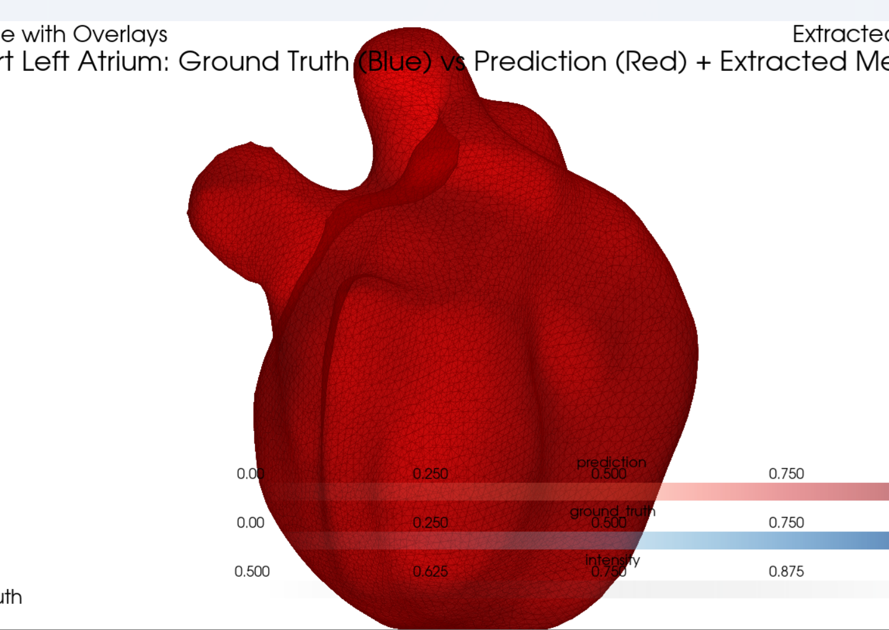

# 3D Heart Left Atrium Segmentation using UNet3D

<table>
  <tr>
    <td></td> 
    <td></td>
  </tr>
</table>


---

This project focuses on the **segmentation of the left atrium** from volumetric CT scans using a **custom 3D U-Net architecture**. Built entirely with **PyTorch**, the pipeline includes:

- Efficient **patch-based training**
- **Sliding window inference** for full volumes
- Dice + CrossEntropy **hybrid loss**
- Rich **3D visualizations** with overlays and mesh extraction using PyVista

> Developed in just **2 days** as a personal deep learning deep-dive.

---

## Dataset

- **Source**: [Medical Segmentation Decathlon – Task02_Heart](http://medicaldecathlon.com/)
- **Format**: NIfTI (`.nii.gz`) 3D volumetric CT scans
- **Labels**:  
  - `0` – Background  
  - `1` – Left Atrium

---

## Final Metrics

| Metric                | Value     |
|-----------------------|-----------|
| **Training Dice (Atrium)** | 0.7725    |
| **Validation Dice (Atrium)** | **0.8537** |
| **Background Dice**   | > 0.99    |
| **Best Epoch**        | 22        |

> Training was conducted over **65 epochs**, after which performance plateaued.

---

## Project Structure

```bash
.
├── train.ipynb           # Full training script
├── inference.py       # Inference + 3D visualization
├── metrics/                 # Segmentations, meshes, visualizations
└── README.md
````

---

### Requirements

* Python 3.8+
* PyTorch >= 2.0
* nibabel
* numpy
* scikit-image
* tqdm
* pyvista
* scikit-learn


---

## Inference + Visualization

### Run Inference on a Volume

```bash
python inference.py \
  --model_path ./checkpoints/best_model.pth \
  --image_path ./imagesTr/case_001.nii.gz \
  --gt_path ./labelsTr/case_001.nii.gz \
  --output_dir ./outputs/case_001 \
  --save_mesh \
  --device cuda
```

### Features:

* Sliding window inference for full-size volumes
* 3D visualization of:

  * CT scan (grayscale)
  * Ground Truth (blue)
  * Prediction (red)
  * Extracted mesh (red, shifted view)
* Optionally exports **STL mesh files** for 3D viewing or printing

---

## Visual Results

### Metrics Graphs

*Training vs Validation Loss and Dice Scores*

<table>
  <tr>
    <td></td> 
    <td></td>
  </tr>
</table>


---
